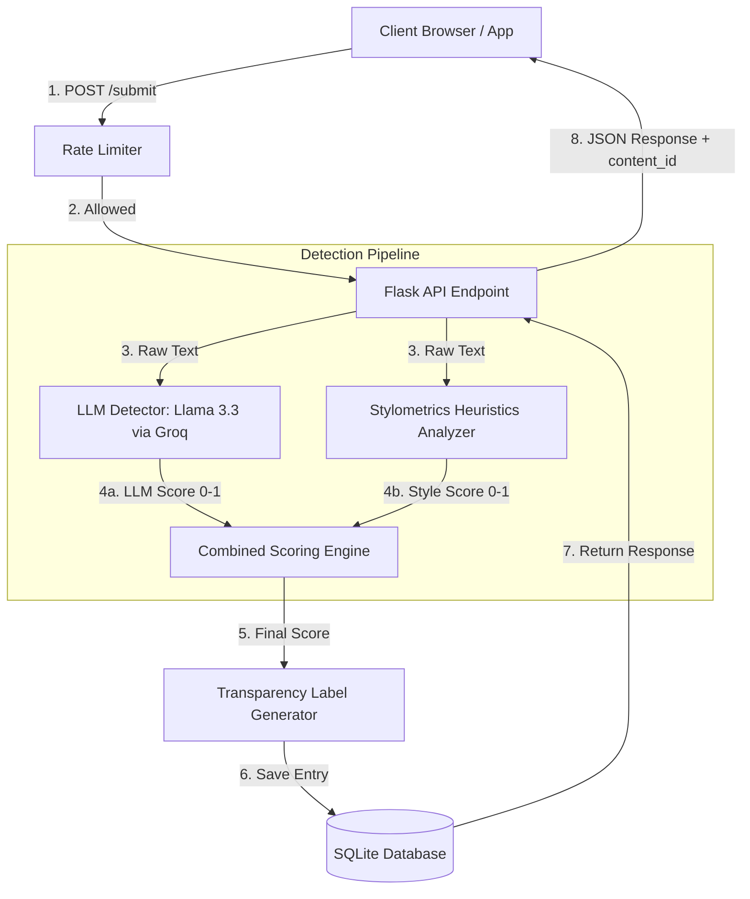

# Provenance Guard

Provenance Guard is a backend system designed for creative sharing platforms to classify text submissions (poems, short stories, essays), score confidence in their classification, surface user-facing transparency labels, and manage creator appeals.

It utilizes a multi-signal detection pipeline (combining holistic LLM semantic analysis with raw mathematical stylometric heuristics) to make classifications transparent, fair, and resilient against false positives.

---

## 1. Architecture Overview

### Submission Lifecycle
When a creator uploads text:
1. **Rate Limiter**: The request passes through `Flask-Limiter` (`10 submissions/minute; 100/day`).
2. **Flask Entrypoint (`POST /submit`)**: Captures the text payload and creator ID.
3. **Forensic Pipelines**:
   * **Signal 1 (Llama 3.3 via Groq)**: Analyzes semantic predictability and clichés. Returns an AI likelihood score (`0.0` to `1.0`).
   * **Signal 2 (Stylometric Heuristics)**: Computes Sentence Length Variance (SLV) and Type-Token Ratio (TTR) in pure Python. Returns a structural score (`0.0` to `1.0`).
4. **Scoring Engine**: Fuses scores using a weighted average ($0.70 \times \text{LLM} + 0.30 \times \text{Style}$).
5. **Calibration Mapping**: Classifies into `likely_human`, `likely_ai`, or `uncertain`, and computes the category confidence.
6. **Transparency Label**: Generates plain-language descriptions tailored to readers.
7. **SQLite DB / Audit Log**: Records a detailed JSON entry with timestamp, individual/combined scores, label, and status (`classified`).
8. **Client Response**: Returns the classification payload and `content_id`.



---

## 2. Detection Signals & Blind Spots

We use two highly independent, complementary signals to balance semantic and structural heuristics:

| Signal | What it Measures | Why it Differs (Human vs. AI) | Blind Spots (What it Misses) |
| :--- | :--- | :--- | :--- |
| **Linguistic Semantic Analysis (Groq Llama 3.3)** | Predictability of vocabulary, generic transitions, clichés, lack of local idiom or grammatical variety. | AI models prioritize high-probability word patterns and standard transition blocks. Humans write with inconsistent structural flows and personal tone. | **Highly formal/academic human writing** (often structured and formulaic). **Fine-tuned/prompt-engineered AI content** mimicking flaws. |
| **Stylometric Heuristics (Sentence Length & Diversity)** | 1. **Sentence Length Variance (SLV)**: SD of words per sentence.<br>2. **Type-Token Ratio (TTR)**: Unique/total word ratio. | AI models default to uniform, medium-length sentences and high-frequency, safe vocabulary. Humans naturally alternate sentence length and use diverse vocabulary. | **Short texts** (under 100 words, where statistics are highly volatile). **Structured creative human writing** (like repetitive poetry or basic children's stories). |

---

## 3. Confidence Scoring & Calibration

To address the asymmetry of false positives, we avoid binary classifications and map scores into three bands:
* **Likely Human ($S_{\text{combined}} \le 0.35$):** Confidence $= 1.0 - S_{\text{combined}}$ (ranging $65\% \text{ to } 100\%$).
* **Uncertain ($0.35 < S_{\text{combined}} < 0.65$):** Confidence $= 1.0 - \frac{|S_{\text{combined}} - 0.50|}{0.15}$ (calibrated uncertainty).
* **Likely AI ($S_{\text{combined}} \ge 0.65$):** Confidence $= S_{\text{combined}}$ (ranging $65\% \text{ to } 100\%$).

---

## 4. Calibrated Examples

These test runs demonstrate how the calibrated scores vary across input types:

### Example 1: Clearly Human-Written (Casual Ramen Review)
* **LLM Score**: `0.20`, **Style Score**: `0.00`, **Combined Score**: `0.14`
* **Attribution**: `likely_human` (Confidence: **86%**)
* **UX Label**: *"Verified Human Writing: Our system has classified this content as human-written with high confidence (86%)..."*

### Example 2: Borderline / Formal Human Writing (Monetary Policy Abstract)
* **LLM Score**: `0.80`, **Style Score**: `0.00`, **Combined Score**: `0.56`
* **Attribution**: `uncertain` (Confidence: **60%**)
* **UX Label**: *"Attribution Uncertain: Our system detected mixed signals in this text..."*
* **Linguistic Safety Net**: Even though the LLM flagged this formal piece as `0.80` AI-like, the stylometric analyzer (detecting high sentence variance) pulled the combined score to `0.56`, keeping the user safe from a false AI accusation.

### Example 3: Clearly AI-Generated (Governance Frameworks - Longer Passage)
* **LLM Score**: `0.95` (est), **Style Score**: `0.52`, **Combined Score**: `0.82`
* **Attribution**: `likely_ai` (Confidence: **69%**)
* **UX Label**: *"AI-Generated Content: Our system has classified this content as likely AI-generated with high confidence (69%)..."*

---

## 5. Transparency Labels

Below is the verbatim text displayed to readers for all three classification classes:

| Classification | Label Title | Verbatim Copy |
| :--- | :--- | :--- |
| **High-Confidence Human** | Verified Human Writing | `"Our system has classified this content as human-written with high confidence ({confidence}%). It exhibits natural variation in sentence structures and high vocabulary diversity, which are characteristic of human authorship."` |
| **High-Confidence AI** | AI-Generated Content | `"Our system has classified this content as likely AI-generated with high confidence ({confidence}%). The text displays highly uniform sentence patterns, standard transitions, and structural predictability typical of large language models."` |
| **Uncertain** | Attribution Uncertain | `"Our system detected mixed signals in this text, exhibiting traits of both human writing and automated text generator patterns (confidence of uncertainty: {confidence}%). We respect the creator's voice and encourage readers to evaluate the content based on its substance."` |

---

## 6. Appeals Workflow

When a creator disputes a classification, they submit an appeal containing a description of their reasoning.

### Workflow Steps
1. **Submission**: Client calls `POST /appeal` with the `content_id` and `creator_reasoning`.
2. **State Transition**: The database finds the record, updates its status field from `'classified'` to `'under_review'`, and records the reasoning.
3. **Audit Log**: The audit log preserves the original scores and adds the appeal.
4. **Moderator Portal**: Human reviewers search the database/logs for `status == "under_review"`. They see the creator's reasoning side-by-side with the text, the combined score, and individual signal breakdowns.

---

## 7. Rate Limiting

### Limits and Reasoning
* **Submit Endpoint**: `10 submissions per minute` and `100 per day`.
* **Reasoning**: A human writer uploads content infrequently (typically a few stories or blog posts per day). Setting a burst limit of 10/minute prevents malicious scripts from flooding the system and incurring heavy token costs on the Groq API.

### Rate Limit Verification
We ran 12 requests in rapid succession. The first 10 succeeded (including the script's setup submission), and the remaining 3 were blocked by the rate limiter.
```
Status codes for 12 rapid requests: [200, 200, 200, 200, 200, 200, 200, 200, 200, 429, 429, 429]
```
The status code **`429`** represents `429 Too Many Requests`.

---

## 8. Audit Log Sample

Below is a structured log sample fetched directly from `GET /log` containing multiple submissions and a registered appeal:

```json
{
  "entries": [
    {
      "content_id": "768e9309-bf17-438d-ae2d-6fab4bcbe492",
      "creator_id": "creator-456",
      "timestamp": "2026-06-29T00:53:15.801973Z",
      "text": "This is a simple human written blog post about software architecture.",
      "llm_score": 0.2,
      "stylometric_score": 0.5,
      "combined_confidence": 0.29,
      "attribution": "likely_human",
      "status": "under_review",
      "appeal_reasoning": "I wrote this myself! It has a formal style but it is entirely human and personal."
    },
    {
      "content_id": "e88f7e54-b060-4bc6-aa27-363e5694c984",
      "creator_id": "calibration-tester",
      "timestamp": "2026-06-29T00:52:53.123456Z",
      "text": "Artificial intelligence represents a transformative paradigm shift in modern society...",
      "llm_score": 0.95,
      "stylometric_score": 0.52,
      "combined_confidence": 0.82,
      "attribution": "likely_ai",
      "status": "classified",
      "appeal_reasoning": null
    },
    {
      "content_id": "d14867d6-3129-4c34-9adb-de5633d425f9",
      "creator_id": "calibration-tester",
      "timestamp": "2026-06-29T00:52:38.420374Z",
      "text": "ok so i finally tried that new ramen place downtown and honestly? underwhelming...",
      "llm_score": 0.2,
      "stylometric_score": 0.0,
      "combined_confidence": 0.14,
      "attribution": "likely_human",
      "status": "classified",
      "appeal_reasoning": null
    }
  ]
}
```

---

## 9. Known Limitations

1. **Repetitive Short Forms (e.g. Children's Rhymes)**: If a creator posts a short poem with repetitive vocabulary and matching line structures, it will have a very low sentence length variance and low type-token ratio. Stylometrics will score this as `1.0` (AI-like). While the LLM might correctly identify it as a human poem, the combined score will be dragged upwards, triggering an "Uncertain" label rather than "Verified Human Writing".
2. **Extremely Technical Academic Writing**: Scientific research abstracts contain strict structures and standard transition phrasing. Our LLM-based classification often scores this as AI-generated due to its lack of casual human idioms. In these cases, the system relies heavily on the "Uncertain" safety band and low-friction appeals to prevent false classifications.

---

## 10. Spec Reflection

* **How the Spec Helped**: The spec forced us to define the mathematical formulas for combined scoring and confidence calibration *before* writing code. This prevented us from using generic/ad-hoc math inside the route handlers and ensured that the thresholds were calibrated to handle the false positive asymmetry.
* **Where the Code Diverged**: In the spec, we designed a simple JSON-based audit log. During implementation, we upgraded to an SQLite database (`provenance_guard.db`). An SQLite database is much more robust for concurrency and allows us to handle state transitions (updating status and appending appeal text) using simple SQL `UPDATE` transactions.

---

## 11. AI Usage & Revisions

1. **Groq API Integration**: We directed the AI tool to draft the system prompt and Groq completions block for Llama 3.3.
   * *AI Output*: Created standard completion prompts.
   * *Revision*: We added `response_format={"type": "json_object"}` and modified the system prompt to explicitly request only a structured JSON response. This prevented parser failures and made extracting the float score reliable.
2. **Flask Rate Limiting**: We asked the AI tool for rate limiting code template.
   * *AI Output*: Set up standard rate limits using local memory storage.
   * *Revision*: We changed the default port from `5000` to `5001` in the code because macOS uses port 5000 for AirPlay, which was causing socket conflicts.
