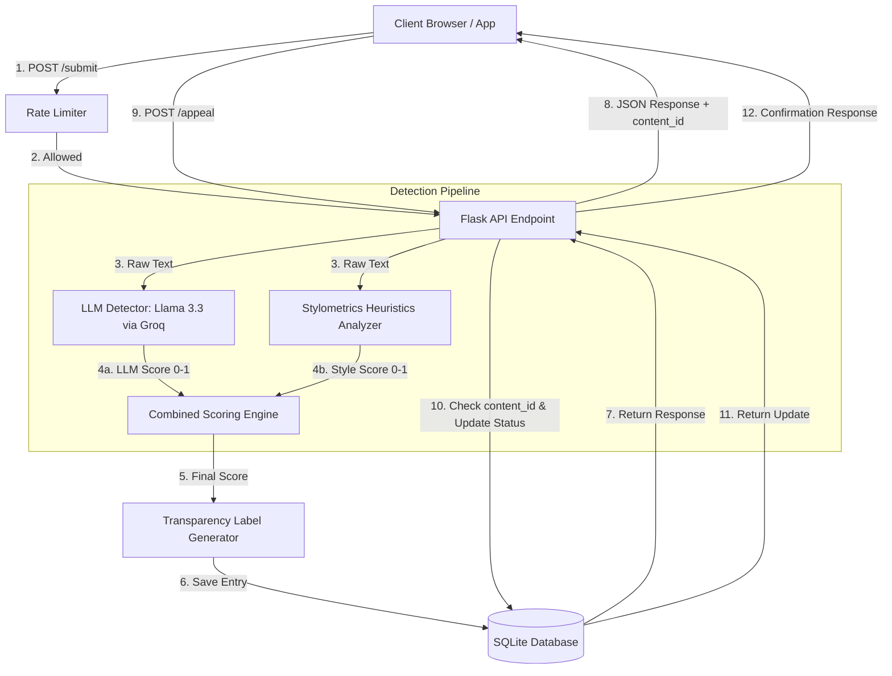

# Provenance Guard: System Specification & Planning

This document outlines the detailed system design, classification logic, API contracts, and implementation plan for the **Provenance Guard** backend system.

---

## 1. Detection Signals

We implement a multi-signal detection pipeline to assess whether submitted text is human-written or AI-generated.

### Signal 1: LLM-Based Stylistic & Semantic Coherence (Groq API)
* **What it measures:** Semantic flow, lexical transitions, structural predictability, and stylistic clichés.
* **Why it differs:** AI models default to highly standard, grammatically correct, and low-entropy sequences. They frequently use typical transition markers (e.g., "Furthermore," "In conclusion," "It is important to note") and exhibit a lack of personal voice. Humans write with idiomatic expressions, variable logic, occasional colloquialisms, and structural asymmetry.
* **Output Format:** A float score between `0.0` (clearly human) and `1.0` (clearly AI).
* **Blind Spots:** Extremely polished, academic, or formal writing by human experts can trigger false AI scores. Prompt-engineered AI content designed to mimic human flaws or use dialectal slang can bypass this detector.

### Signal 2: Stylometric Heuristics (Sentence Length & Vocabulary Diversity)
* **What it measures:** 
  1. **Sentence Length Variance (SLV):** Standard deviation of sentence lengths (word count per sentence).
  2. **Type-Token Ratio (TTR):** Ratio of unique words to total words (vocabulary diversity).
* **Why it differs:** Humans write with highly variable sentence lengths (alternating short punchy sentences with long complex compound clauses) and a rich, sometimes repetitive but idiosyncratic vocabulary. AI writing is highly homogeneous, hovering around medium-length sentences with safe, high-probability vocabulary (lower TTR and lower SLV).
* **Output Format:** A float score between `0.0` (clearly human) and `1.0` (clearly AI), computed using standard normalized curves.
* **Blind Spots:** Mathematical statistics like SLV and TTR become highly volatile and unreliable on short texts (under 100 words). Highly repetitive creative human writing (e.g., children's stories or specific poem styles) may score low on SLV and TTR, looking like AI.

### Signal Fusion (Combining Scores)
The scores are combined using a weighted average:
$$\text{Score}_{\text{combined}} = (w_{\text{LLM}} \times S_{\text{LLM}}) + (w_{\text{style}} \times S_{\text{style}})$$
Where we assign $w_{\text{LLM}} = 0.70$ and $w_{\text{style}} = 0.30$. The LLM score gets a higher weight because it captures semantic and stylistic nuances, while the stylometric score provides structural validation.

---

## 2. Uncertainty Representation & Calibration

Rather than forcing a binary classification, Provenance Guard maps the combined score to three distinct categories. We design this mapping to handle the asymmetry of false positives (falsely accusing a human of using AI is worse than missing a piece of AI writing).

### Thresholds
* **Likely Human ($S_{\text{combined}} \le 0.35$):** The text is classified as human-written.
* **Uncertain ($0.35 < S_{\text{combined}} < 0.65$):** The text displays mixed traits, which triggers a protective "Uncertain" label to avoid false accusations.
* **Likely AI ($S_{\text{combined}} \ge 0.65$):** The text is classified as AI-generated.

### Confidence Score Mapping
To display a readable confidence percentage, we map the combined score to a confidence value $C$ between `0.0` and `1.0` depending on the category:
* **Likely Human ($S_{\text{combined}} \le 0.35$):** 
  $$C = 1.0 - S_{\text{combined}}$$ 
  *(Ranges from 0.65 to 1.0. A score of 0.0 results in 100% confidence).*
* **Likely AI ($S_{\text{combined}} \ge 0.65$):** 
  $$C = S_{\text{combined}}$$ 
  *(Ranges from 0.65 to 1.0. A score of 1.0 results in 100% confidence).*
* **Uncertain ($0.35 < S_{\text{combined}} < 0.65$):** 
  $$C = 1.0 - \frac{|S_{\text{combined}} - 0.50|}{0.15}$$ 
  *(Represents confidence in the uncertainty. Ranges from 0.0 to 1.0. A score of 0.50 is 100% uncertain).*

---

## 3. Transparency Label Design

The submission endpoint returns a transparency label object composed of a clear title and plain-language description tailored to non-technical readers.

### 1. High-Confidence Human Label
* **Title:** "Verified Human Writing"
* **Verbatim Copy:** `"Our system has classified this content as human-written with high confidence ({confidence}%). It exhibits natural variation in sentence structures and high vocabulary diversity, which are characteristic of human authorship."`

### 2. High-Confidence AI Label
* **Title:** "AI-Generated Content"
* **Verbatim Copy:** `"Our system has classified this content as likely AI-generated with high confidence ({confidence}%). The text displays highly uniform sentence patterns, standard transitions, and structural predictability typical of large language models."`

### 3. Uncertain Label
* **Title:** "Attribution Uncertain"
* **Verbatim Copy:** `"Our system detected mixed signals in this text, exhibiting traits of both human writing and automated text generator patterns (confidence of uncertainty: {confidence}%). We respect the creator's voice and encourage readers to evaluate the content based on its substance."`

---

## 4. Appeals Workflow

When a creator contests a classification, the appeals flow allows them to register their dispute and triggers an immediate status change.

1. **Submission:** A creator submits their appeal via `POST /appeal` providing the `content_id` and a `creator_reasoning` text field.
2. **Status Progression:** 
   * The status of the content in the database changes from `classified` to `under_review`.
   * The `creator_reasoning` is saved to the record.
3. **Audit Log:** The audit log entry is updated with the appeal request, timestamp, and reasoning.
4. **Reviewer Portal:** The administrative view (exposed via query parameters or filter on GET `/log`) shows all entries where `status == "under_review"`. A human moderator sees:
   * Content ID & Creator ID
   * The original text snippet
   * The combined confidence score and individual signal scores
   * The creator's reasoning for appeal

---

## 5. Anticipated Edge Cases

1. **Structured Poetry or Song Lyrics:** A poem might contain a repeating refrain and a simplified, highly repetitive vocabulary. This results in a low Type-Token Ratio (TTR) and low Sentence Length Variance (SLV), which will skew the stylometric heuristic score toward "AI-generated". The LLM classifier must be prompted to recognize poetic structures to mitigate this.
2. **Technical and Scientific Abstracts:** Highly formal academic writing uses very uniform sentence structures and standardized transitions (e.g., "Furthermore," "Therefore," "The results indicate"). Stylometrics and LLM-based classifiers are likely to score this as AI-generated due to its lack of colloquial variation, resulting in a false positive. We rely on the "Uncertain" category and low-friction appeals to handle this.

---

## 6. System Architecture

### Diagram

### Architectural Narrative
1. **Submission Flow**: The client calls `POST /submit` with text and creator ID, restricted by the Flask-Limiter rate limiter. The Flask endpoint executes two parallel detection signals (Groq API and stylometric heuristics), fuses their scores into a calibrated confidence score, generates the appropriate transparency label text, saves the run to a SQLite database/audit log, and returns the response.
2. **Appeal Flow**: The client calls `POST /appeal` with a content ID and reasoning. The API verifies the ID exists in the database, updates the status to `under_review`, records the reasoning, updates the audit log, and returns a confirmation JSON.

---

## 7. AI Tool Plan

### Milestone 3: Submission Endpoint & First Detection Signal
* **Spec Sections Used:** Section 1 (LLM-based detection), Section 6 (Architecture: Submission flow).
* **Code Generation Targets:** 
  * A basic Flask app structure with SQLite database initialization.
  * A `POST /submit` endpoint accepting `text` and `creator_id`.
  * The Groq LLM-based detection function returning a score between `0.0` and `1.0`.
  * Basic JSON-based logging or SQLite write functions.
* **Verification Approach:** Test the `/submit` endpoint using a curl command. Ensure it returns a `content_id`, a hardcoded confidence score, and writes a basic record to the database. Verify that the LLM score function correctly parses the Groq API response.

### Milestone 4: Second Signal & Confidence Scoring
* **Spec Sections Used:** Section 1 (Stylometric Heuristics & Fusion), Section 2 (Uncertainty Calibration).
* **Code Generation Targets:**
  * Stylometric analysis functions in pure Python (SLV and TTR calculations).
  * Score normalization logic (mapping SLV and TTR to 0-1 curves).
  * Combined scoring and calibration logic implementing the mathematical formulas in Section 2.
* **Verification Approach:** Feed the system four distinct inputs: one highly robotic AI block, one highly colloquial human block, one scientific abstract, and one simple repetitive text. Check that the combined confidence score behaves as expected and produces the correct classification labels.

### Milestone 5: Production Layer
* **Spec Sections Used:** Section 3 (Transparency Labels), Section 4 (Appeals), Section 6 (Architecture).
* **Code Generation Targets:**
  * The `POST /appeal` endpoint that updates database status and reasoning.
  * The `GET /log` endpoint showing entries and filtering for open appeals.
  * Flask-Limiter integration with memory storage.
  * Full transparency label formatting logic.
* **Verification Approach:** Submit a sample, obtain a `content_id`, call `/appeal` with that ID, and run `GET /log` to verify status is `under_review`. Run an automated bash loop to send 12 requests quickly to ensure rate limiting correctly blocks with `429 Too Many Requests`.

---

## 8. Stretch Features

### Analytics Dashboard (Option A)
* **Goal**: Build a visual view showing detection patterns, appeal rates, and key metadata.
* **Implementation**:
  * Route: `GET /dashboard`
  * Frontend: A beautifully designed responsive HTML view featuring:
    * Stats counters: Total submissions, average confidence percentage, total appeals lodged, and the appeal rate.
    * Visual distribution bar: A CSS-styled horizontal bar segment representing the proportion of Likely Human, Uncertain, and Likely AI detections in HSL/neon shades (Emerald, Amber, and Rose).
    * Recent Log: A table displaying the last 15 entries containing timestamp, creator, raw text snippet, combined score vs. individual signal breakdowns, attribution badge, and an expanding container showcasing the appeal reasoning if the content is `'under_review'`.

